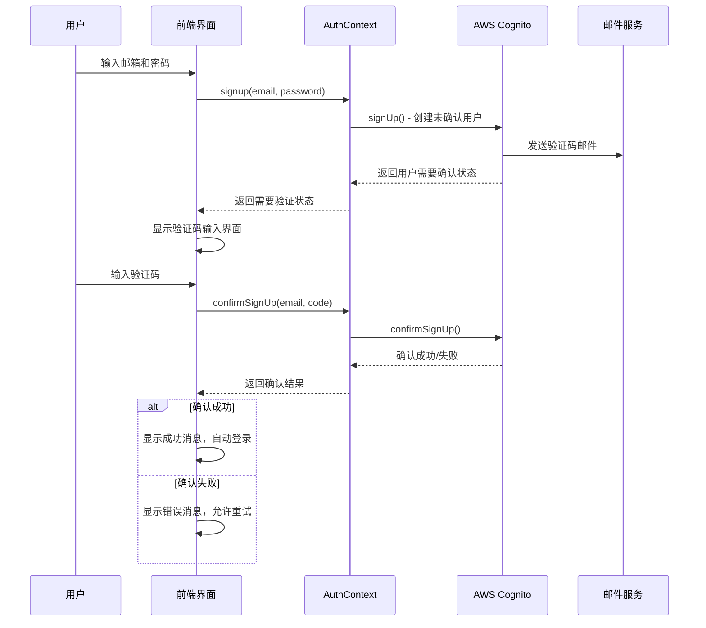
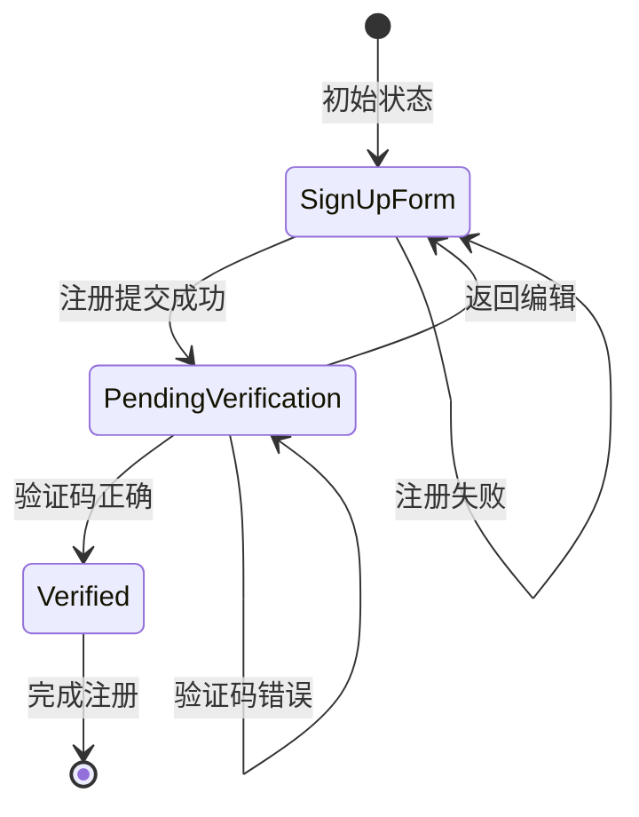

# 设计文档

## 概述

本设计文档描述了如何修复用户注册流程中的邮箱验证码UI缺失问题。我们将实现一个完整的两步注册流程：首先收集用户信息并发送验证码，然后通过验证码确认完成用户创建。

## 架构

### 注册流程架构



### 状态管理架构



## 组件和接口

### 1. 认证状态枚举

```typescript
enum AuthState {
  SIGN_UP_FORM = 'SIGN_UP_FORM',
  PENDING_VERIFICATION = 'PENDING_VERIFICATION', 
  VERIFIED = 'VERIFIED'
}
```

### 2. 验证码组件接口

```typescript
interface VerificationCodeInputProps {
  email: string;
  onVerify: (code: string) => Promise<boolean>;
  onResendCode: () => Promise<boolean>;
  onBack: () => void;
  isLoading: boolean;
  error?: string;
}
```

### 3. AuthContext 扩展接口

```typescript
interface AuthContextType {
  // 现有属性...
  authState: AuthState;
  pendingEmail: string | null;
  confirmSignUp: (email: string, code: string) => Promise<boolean>;
  resendConfirmationCode: (email: string) => Promise<boolean>;
}
```

### 4. 注册响应接口

```typescript
interface SignUpResult {
  success: boolean;
  needsVerification: boolean;
  error?: string;
}
```

## 数据模型

### 验证码输入状态

```typescript
interface VerificationState {
  code: string;
  isLoading: boolean;
  error: string | null;
  canResend: boolean;
  resendCountdown: number;
}
```

### 注册表单状态

```typescript
interface SignUpFormState {
  email: string;
  password: string;
  isLoading: boolean;
  error: string | null;
  authState: AuthState;
}
```

## 错误处理

### 错误类型映射

```typescript
const ERROR_MESSAGES = {
  // Cognito 错误码映射
  'CodeMismatchException': '验证码不正确，请重新输入',
  'ExpiredCodeException': '验证码已过期，请重新发送',
  'LimitExceededException': '尝试次数过多，请稍后再试',
  'InvalidParameterException': '输入格式不正确',
  'UsernameExistsException': '该邮箱已被注册',
  'TooManyRequestsException': '请求过于频繁，请稍后再试',
  // 通用错误
  'NetworkError': '网络连接失败，请检查网络',
  'UnknownError': '发生未知错误，请重试'
};
```

### 错误处理策略

1. **验证码错误**：显示具体错误信息，允许重新输入
2. **网络错误**：显示网络错误提示，提供重试按钮
3. **频率限制**：显示倒计时，禁用重发按钮
4. **用户已存在**：引导用户到登录界面

## 测试策略

### 单元测试

1. **AuthContext 测试**
   - 测试 signup 函数返回正确的状态
   - 测试 confirmSignUp 函数处理各种响应
   - 测试 resendConfirmationCode 函数
   - 测试错误处理逻辑

2. **VerificationCodeInput 组件测试**
   - 测试验证码输入验证（6位数字）
   - 测试重发按钮倒计时功能
   - 测试错误状态显示
   - 测试返回编辑功能

3. **LoginForm 组件测试**
   - 测试注册流程状态切换
   - 测试表单验证
   - 测试错误消息显示

### 集成测试

1. **完整注册流程测试**
   - 测试从注册表单到验证码确认的完整流程
   - 测试各种错误场景的处理
   - 测试重发验证码功能

2. **AWS Cognito 集成测试**
   - 测试与真实 Cognito 服务的交互
   - 测试邮件发送功能
   - 测试用户状态管理

### 用户体验测试

1. **响应式设计测试**
   - 测试在不同设备上的显示效果
   - 测试验证码输入框的可用性

2. **可访问性测试**
   - 测试键盘导航
   - 测试屏幕阅读器兼容性
   - 测试颜色对比度

## 安全考虑

### 验证码安全

1. **验证码格式**：6位数字，有效期5分钟
2. **重发限制**：60秒内只能重发一次
3. **尝试限制**：连续5次错误后锁定10分钟
4. **输入验证**：前端验证6位数字格式

### 用户数据保护

1. **邮箱隐私**：在验证界面只显示部分邮箱地址
2. **状态清理**：验证失败后清理敏感状态
3. **会话管理**：验证成功后自动建立安全会话

## 性能优化

### 组件优化

1. **懒加载**：验证码组件按需加载
2. **状态缓存**：合理缓存用户输入状态
3. **防抖处理**：验证码输入防抖验证

### 网络优化

1. **请求重试**：网络失败时自动重试
2. **超时处理**：设置合理的请求超时时间
3. **错误恢复**：提供手动重试机制