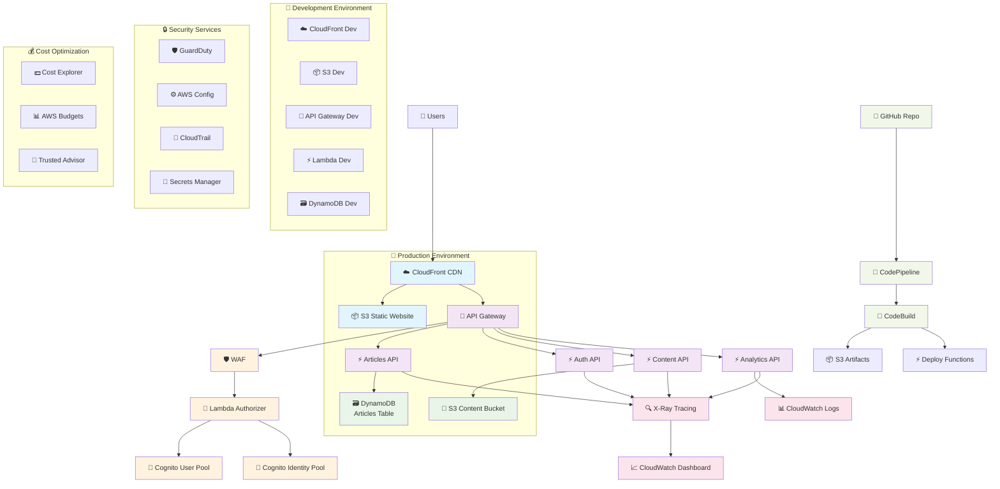
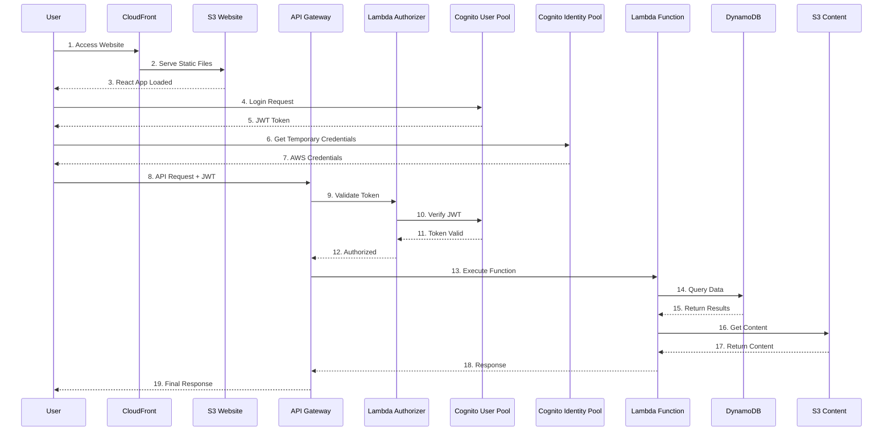
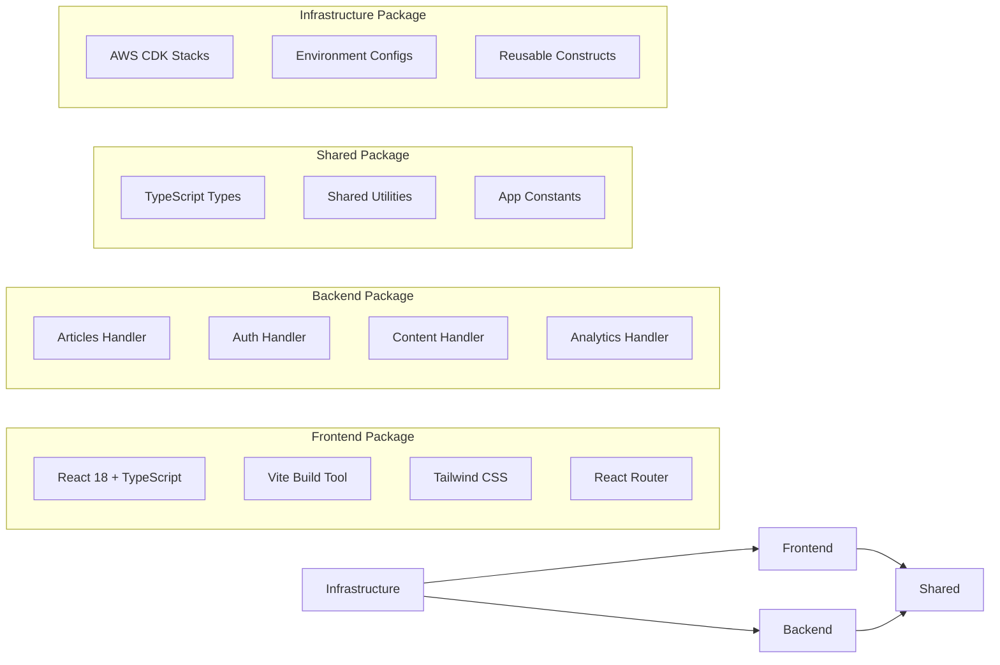
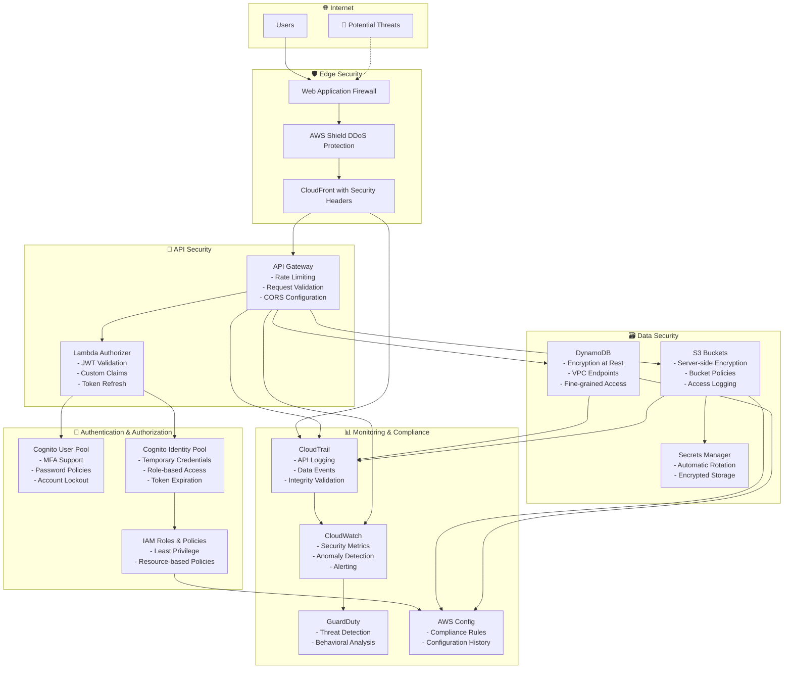
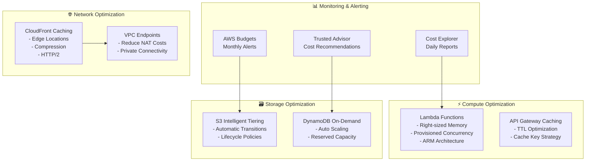

# LuLu Ventures Platform - Complete CDK Architecture

## 🏗️ Proposed Architecture Diagram

## 🔄 Data Flow Architecture

## 📊 Component Architecture

## 🛡️ Security Architecture

## 💰 Cost Optimization Strategy

